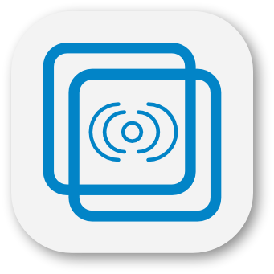

<p align="center">
  
</p>

<h1 align="center">📡 OffCast</h1>

<p align="center">
  <strong>Ultra-Low Latency Offline P2P Screen Mirroring & Wireless Studio Camera Monitor</strong><br>
  <em>Direct Wi-Fi Hotspot • Zero Internet • Hardware-Accelerated WebRTC • &lt;25ms Glass-to-Glass Latency</em>
</p>

<p align="center">
  
  
  
  
  
  
  
</p>

---

## 📖 Overview

**OffCast** is a professional-grade, high-performance offline screen mirroring and wireless camera viewfinder suite built with **Flutter**, native **Kotlin/Android subsystems**, and **WebRTC**.

Designed specifically for **content creators, solo videographers, educators, and mobile gamers**, OffCast allows you to turn an Android/iOS tablet or secondary phone into a **zero-delay wireless director's monitor** or teleprompter without needing an internet connection, cloud infrastructure, or specialized capture cards.

---

## 🌟 Key Features

### ⚡ Ultra-Low Latency Video Pipeline (&lt;25ms)
- **Hardware-Accelerated Encoding**: Direct hardware encoding using H.264 Baseline Profile via platform MediaCodec.
- **Zero-Delay Playout Engine**: Injects SDP extensions (`a=playout-delay:0 0`) and strips high-latency B-frames (`profile-level-id=42e01f`).
- **Dynamic Bitrate & Frame Adaptation**: Smooth 60 FPS streaming with automatic network headroom adjustments.

### 🔒 Pre-Shared PIN (PSP) Session Security
- **Anti-Hijacking Protection**: Protects open hotspot networks from unauthorized stream viewers or eavesdroppers.
- **Two-Tier Authentication Gate**:
  - **HTTP 401 Upgrade Gate**: Direct query parameter authentication (`?pin=XXXX`) during WebSocket handshake.
  - **In-Band Fallback Handshake**: 3-second grace period with challenge-response payload verification.
- **Brute-Force Rate Limiting**: Exponential lockout on consecutive failed attempts from rogue local IPs.

### 📷 Wireless Studio Camera Viewfinder
- **Record in 4K HDR on Phone, Monitor on Tablet**: Launch your phone's native camera app for cinema-grade capture while watching a real-time monitor feed on your tablet.
- **Selfie Mirroring (Horizontal Flip)**: Flip the receiver feed horizontally for natural framing when recording front-facing videos.
- **Instant 90° Canvas Rotation**: Rotate the monitoring canvas on demand for portrait and landscape framing.

### 🎙️ Offline Speech-Aware Studio Teleprompter
- **On-Device Voice Activity Detection (VAD)**: Native high-priority audio pipeline calculates speech volume and voice activity in real time.
- **Auto-Scrolling Script**: Prompter smoothly auto-scrolls only while you are speaking and pauses instantly when you pause.
- **Customizable Overlay**: Adjustable typography, scroll velocity, and transparent viewport overlays on top of the camera stream.

### 🔄 Android SoftAP Hotspot AP-Isolation Bypass
- **Native In-Process UDP Relay (`LocalUdpRelay`)**: Solves Android's notorious tethering packet-filtering issue where connected clients are isolated from each other.
- Bypasses the Flutter UI event loop by piping raw datagrams through a native OS background thread with a 2MB socket buffer.

### 🎯 Zero-Touch Subnet Auto-Discovery
- **Instant Pairing**: Receiver broadcasts UDP beacon packets across port `8888`.
- Sender automatically discovers receiver devices on the local subnet without typing manual IP addresses.

### 🎨 Light Neumorphic UI & Telemetry HUD
- Clean, eye-friendly `#E9ECEF` neumorphic design system with soft tactile depth and interactive state transitions.
- **Real-Time Floating Diagnostic HUD**: Visualizes live FPS, RTT (Round Trip Time in milliseconds), Bitrate (kbps), and packet loss.

---

## 🏗️ Technical Architecture

```text
       SENDER DEVICE                                  RECEIVER DEVICE
  ┌───────────────────────┐                      ┌───────────────────────┐
  │  Display / Camera     │                      │  Display Monitor      │
  │  (H.264 Baseline)     │                      │  (Zero-Delay Playout) │
  └──────────┬────────────┘                      └───────────▲───────────┘
             │                                               │
             ▼                                               │
   [UDP Subnet Discovery] ═════════════════════════► [UDP Port 8888 Beacon]
             │                                               │
             ▼                                               │
   [Shelf WebSocket Auth] ── (PIN: XXXX / HTTP 401 Gate) ──► [Signaling Server]
             │                                               │
             ▼                                               │
   [WebRTC PeerConnection] ◄── ICE Candidates (SDP) ─────────► PeerConnection
             │                                               ▲
             │                                               │
             └────────► [Native In-Process UDP Relay] ───────┘
                        (Bypasses Hotspot AP Isolation)
```

---

## 🚀 Getting Started

### 1. Connect Devices Over Hotspot
1. Turn on **Personal / Portable Hotspot** on either device (Phone or Tablet).
2. Connect your other device to this Wi-Fi hotspot.
   *(No active mobile data or internet connection is required!)*

### 2. Start Receiver (Monitor / Tablet)
1. Open **OffCast** on the display device and select **Receiver Mode**.
2. Note the displayed **IP Address** (e.g., `192.168.43.1`) and the **4-digit Security PIN**.
3. Keep the receiver screen open.

### 3. Start Sender (Camera Phone / Presenter)
1. Open **OffCast** on the casting phone and select **Sender Mode**.
2. Tap the discovered receiver (or enter the IP and PIN manually).
3. Select your mode:
   - **Screen Mirroring**: For presentations, tutorials, and games.
   - **Studio Camera**: For live video monitoring with optional teleprompter.
4. Tap **Start Stream**.

---

## ⚙️ Performance Presets

| Preset | Target FPS | Target Bitrate | Resolution | Recommended For |
| :--- | :---: | :---: | :---: | :--- |
| **💎 Ultra** | 60 FPS | 5.5 Mbps | 1080p | High-framerate monitoring & fluid motion |
| **⚖️ Balanced** | 30 FPS | 3.5 Mbps | 1080p | Battery efficiency & extended recording |
| **⚡ Performance** | 60 FPS | 2.2 Mbps | 720p | Budget devices & crowded wireless channels |

---

## 📂 Project Structure

```text
offcast/
├── android/                   # Native Android platform layer
│   └── app/src/main/kotlin/com/laithmh/offcast/
│       ├── MainActivity.kt            # Platform channels & multicast locks
│       ├── MediaProjectionService.kt  # Foreground capture service
│       ├── AudioVadEngine.kt          # Native Voice Activity Detection
│       └── NativeUdpRelay.kt          # Low-latency SoftAP socket relay
├── asset/                     # Branded logo and application assets
├── ios/                       # iOS runner & bundle configuration
├── lib/
│   ├── core/                  # Design tokens, theme, and platform helpers
│   ├── features/
│   │   ├── home/              # Mode selection & branding header
│   │   ├── receiver/          # Receiver UI, telemetry HUD, & controls
│   │   ├── sender/            # Sender source picker & streaming state
│   │   ├── signaling/         # Shelf WebSocket server & auto-discovery
│   │   └── teleprompter/      # Offline speech-aware prompter
│   └── main.dart              # Application bootstrap & routing
├── test/                      # 51 unit, widget, and integration tests
└── web/ & windows/            # Cross-platform runner wrappers
```

---

## 🛠️ Development & Verification

### Prerequisites
- Flutter SDK `^3.13.2` or later
- Android SDK 34+ / NDK
- Java 17

### Commands

```bash
# Get dependencies
flutter pub get

# Run static analysis (strict lints)
flutter analyze

# Run complete test suite (51 tests)
flutter test

# Re-generate multi-platform launcher icons
dart run flutter_launcher_icons
```

---

## 📄 License & Rights

This repository is source-available for **portfolio evaluation and educational demonstration purposes only**. All rights are reserved by the author (Laith MH). 

Commercial use, modification for public distribution, re-distribution, and deploying this software or derivative works to public app stores are strictly prohibited without prior written permission. See [LICENSE](LICENSE) for full legal terms.
