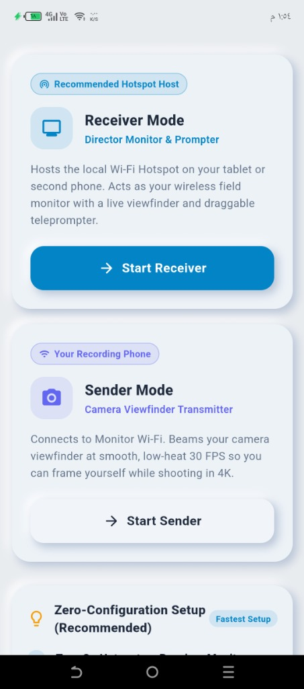
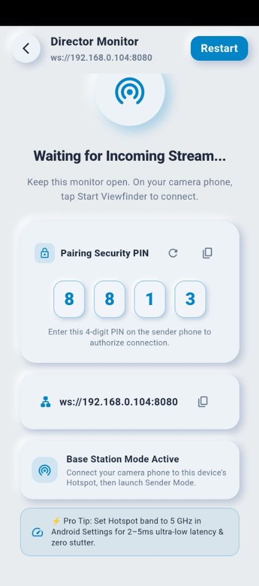
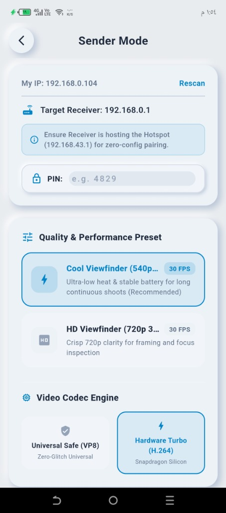

# 🌟 OffCast — Complete Features Showcase

**OffCast** turns any secondary Android tablet or smartphone into a professional, zero-latency **wireless director's monitor and smart teleprompter** for solo mobile video creators and indie film crews.

---

## 📱 Visual Walkthrough

  
  &nbsp;&nbsp;
  
  &nbsp;&nbsp;
  

---

## 🎬 The Creator Dilemma & The OffCast Solution

| The Solo Creator Problem | The OffCast Solution |
| :--- | :--- |
| **Back-Camera Blindness**: Filming with the superior rear camera (4K60, 10-bit HDR, ProRes) means you can't see your framing, focus, or expressions. | **Wireless Viewfinder**: Mirror your recording phone's screen in real time to a tablet mounted right next to your camera lens with **<20ms latency**. |
| **Sensor Lockout**: Third-party camera streaming apps lock the camera hardware, preventing you from using your phone's native camera app and computational photography algorithms. | **Non-Intrusive Screen Mirroring**: OffCast captures the display via Android `MediaProjection`. Your native camera app retains 100% control over the camera sensors and optics. |
| **Thermal Shutdown**: 4K recording generates intense heat. Streaming unoptimized 60 FPS video causes the phone to overheat and shut down after 10 minutes. | **Silicon Thermal Optimization**: Hardware H.264 encoding capped at 30 FPS drops encoder load by 50%, keeping phone temperature **under 40°C** for 30+ minute takes. |
| **Internet & Cloud Reliance**: Studio or outdoor locations often lack reliable Wi-Fi, and public networks suffer from heavy congestion. | **100% Offline Direct Hotspot**: Works anywhere on earth over a direct phone-to-tablet Wi-Fi hotspot with zero data usage. |

---

## 🚀 Key Feature Breakdown

### 1. ⚡ Ultra-Low Latency Viewfinder (<20ms Glass-to-Glass)
- **Zero Jitter Buffering**: Injects `a=playout-delay:0 0` directly into the WebRTC stream session, instructing the receiver to render frames immediately upon arrival.
- **5 GHz Hotspot Optimization**: Leveraging 5 GHz direct Wi-Fi drops wireless ping to `2–5ms`, delivering a virtually instantaneous mirror feed indistinguishable from a wired HDMI cable.
- **Fluid 30 FPS Pacing**: Bypasses Android's dynamic display throttling with a 24 FPS floor, preventing stutter or frozen frames when you stand still in front of the lens.

### 2. 📜 Floating HUD Teleprompter with Voice Activity Detection (VAD)
- **Draggable & Resizable Overlay**: Place the prompter anywhere on the monitor screen—place it directly adjacent to your camera lens so your eye contact remains pinned on your audience.
- **Smart Speech-Aware Auto-Scroll**: Uses on-device native audio analysis (PCM-16 RMS DSP) to detect when you are speaking. The script scrolls smoothly while you talk and pauses automatically when you stop to breathe or think.
- **Transparent Floating Text Mode**: Strips away the solid background with one tap, leaving crisp, high-contrast floating typography with drop-shadows over your live camera feed.

### 3. 📚 Persistent Offline Script Library
- **Local Storage**: Automatically saves all scripts, font sizes, opacity, and scroll speeds on the tablet using `SharedPreferences`.
- **Segment Switching**: Create and switch between multiple script cards (*"Hook / Intro"*, *"Key Value Prop"*, *"Sponsor Read"*, *"Call to Action"*) without touching a laptop.
- **Dynamic Reading Metrics**: Live word count and dynamic reading time calculation calibrated to your selected Words-Per-Minute (WPM) velocity.

### 4. 📐 Social Framing Guides & Composition Safe Zones
- **Shorts & TikTok 9:16 Safe Zones**: Overlay visual markers showing where TikTok, Instagram Reels, and YouTube Shorts UI overlays (captions, like buttons, comments) will cover your video.
- **Rule-of-Thirds Grid (3×3)**: Traditional cinematic composition grid to lock eye horizons and optimize head-room.
- **Widescreen 16:9 & Square 1:1 Guides**: Frame YouTube video essays and square Instagram carousel content accurately.
- **Zero Phone Overhead**: All vector graphics are drawn natively on the tablet GPU using Flutter `CustomPainter`, consuming **0% CPU** on the recording phone.

### 5. ❄️ Thermal Profiles & Performance Presets

Creators can choose between two engineered profiles depending on shooting conditions:

| Preset | Resolution | Target FPS | Bitrate | Thermal Target | Ideal Use Case |
| :--- | :---: | :---: | :---: | :---: | :--- |
| **❄️ Cool Viewfinder** | 540p | 30 FPS | ~850 Kbps | **<38°C (Cold)** | Long continuous takes (30+ min), battery endurance |
| **🎬 HD Viewfinder** | 720p | 30 FPS | ~1800 Kbps | **<41°C (Warm)** | Critical focus, lighting setup, makeup, and framing checks |

### 6. 🔒 Pre-Shared PIN (PSP) Session Protection
- **Hotspot Security**: Protects your wireless video feed when operating on open, public, or unencrypted mobile hotspots.
- **Pairing PIN**: The receiver generates a 4-digit numeric PIN. The transmitter must authenticate during connection to prevent unauthorized viewing.
- **Anti-Tampering Rate Limiter**: Automatically locks out IP addresses that fail 5 authentication attempts within 30 seconds.

### 7. 🔄 Native In-Process UDP Relay (Hotspot AP-Isolation Bypass)
- Solves Android's tethering client-isolation bug where devices connected to the same mobile hotspot cannot communicate over peer-to-peer UDP.
- High-priority background thread (`nice = -19`) and 2MB socket buffers guarantee zero dropped frames.

---

## 📋 Quick Setup Guide

1. **Host Hotspot**: Enable Portable Hotspot on your Director Tablet (recommended: 5 GHz band).
2. **Connect Phone**: Connect your Camera Phone to the tablet's Wi-Fi hotspot.
3. **Launch Receiver**: Open OffCast on the tablet -> tap **Director Monitor & Prompter**. Note the 4-digit PIN.
4. **Launch Sender**: Open OffCast on the phone -> tap **Camera Viewfinder Transmitter** -> enter the PIN -> tap **Start Viewfinder Broadcast**.
5. **Film in 4K**: Switch to your phone's native camera app and record with full confidence!
