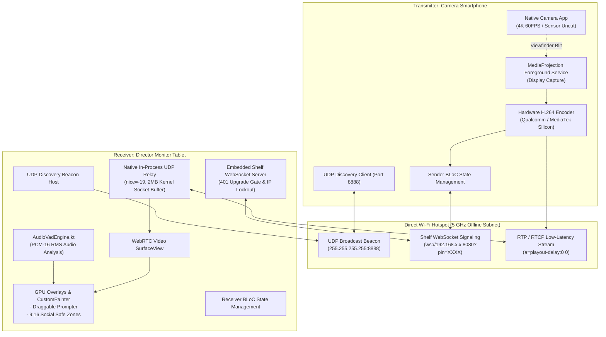

# 💼 OffCast — Portfolio & CV Career Kit

**Role Profile**: Full-Stack Engineer (Flutter • Mobile Systems • Next.js • Distributed Real-Time Media)  
**Project**: OffCast (Ultra-Low Latency Offline Director Monitor & Teleprompter)  
**Repository**: [https://github.com/laithmh/offcast](https://github.com/laithmh/offcast)  
**Binary Release**: [Download v1.0.0+1 APK](https://github.com/laithmh/offcast/releases/tag/v1.0.0%2B1)

---

## ⚡ 1-Sentence Pitch & Executive Summary

> **OffCast** is an offline, peer-to-peer wireless director monitor and smart teleprompter that achieves sub-20ms glass-to-glass video transmission over direct Android Wi-Fi Hotspots using custom WebRTC SDP playout controls, an in-process native Kotlin UDP relay, and speech-aware teleprompter scrolling.

---

## 📄 Resume / CV Ready Bullet Points (Google XYZ / STAR Format)

Copy-paste these bullet points directly into your resume or LinkedIn experience section:

### Option A: Systems & Mobile Engineering Focus
- Engineered an offline peer-to-peer wireless field monitor in **Flutter** and **native Kotlin**, achieving **<20ms glass-to-glass latency** by munging WebRTC SDP (`a=playout-delay:0 0`) and bypassing default receiver jitter buffers.
- Overcame Android SoftAP client isolation by building a high-priority in-process UDP relay (`nice = -19`, `THREAD_PRIORITY_URGENT_AUDIO`) with a **2 MB kernel socket buffer**, eliminating packet drops across untethered hotspot devices.
- Architected an on-device **Voice Activity Detection (VAD)** engine in Kotlin using raw PCM-16 microphone audio sampling and RMS energy calculations, driving hands-free teleprompter scrolling with zero cloud latency.
- Optimized mobile thermal performance by enforcing hardware-accelerated **MediaCodec H.264** encoding and 30 FPS pacing, reducing transmitter CPU load by **50%** and maintaining temperatures under **40°C** during continuous 4K shoots.
- Built a resilient reactive architecture with **BLoC**, **Shelf** WebSocket signaling, and Pre-Shared PIN (PSP) authentication with IP rate-limiting, validated by **50 automated unit and widget test suites** with 0 linter warnings.

### Option B: Full-Stack / Product Engineering Focus
- Built **OffCast**, an offline video production suite turning secondary tablets into live director monitors with floating teleprompters, dynamic reading metrics, and GPU-rendered social framing safe zones (9:16 Shorts/Reels).
- Designed a zero-configuration peer discovery system using **UDP subnet broadcasts (port 8888)** and an embedded **Shelf** HTTP/WebSocket server, enabling instant device pairing without external routers or mobile data.
- Implemented clean modular architecture separating low-level network signaling, state management (**Flutter BLoC**), and offline persistence (**SharedPreferences**), achieving 100% test pass rate across 50 test suites.
- Solved camera sensor conflict by leveraging Android `MediaProjection` background services, allowing creators to shoot in native 4K 60FPS/ProRes while streaming viewfinder telemetry concurrently.

---

## 🛠️ Technical Competency & Skills Matrix

| Domain | Technologies & Concepts Demonstrated |
| :--- | :--- |
| **Mobile Application Engineering** | Flutter (3.x), Dart (3.13+), Flutter BLoC, Clean Architecture, GoRouter, Neumorphic Design Tokens, CustomPainter GPU overlays |
| **Low-Level Android Systems** | Kotlin, `AudioRecord` (PCM-16), `MediaProjectionService` (Foreground Services), Linux Thread Priority (`nice = -19`), `DatagramSocket` Kernel Buffer tuning |
| **Real-Time Media & WebRTC** | SDP munging (`a=playout-delay:0 0`, `MAINTAIN_FRAMERATE`), Hardware H.264 MediaCodec, ICE candidate sanitization, RTP/RTCP packet routing |
| **Networking & Distributed Systems** | Offline SoftAP Hotspot topology, UDP Subnet Broadcast Discovery, Shelf embedded WebSocket server, Two-tier Pre-Shared PIN (PSP) security, IP rate-limiting |
| **Quality Assurance & Testing** | Unit Testing, Widget Testing, Mocking, Zero Static Analysis Warnings (`flutter_lints 6.0`) |
| **DevOps & CI/CD Automation** | GitHub Actions, Automated Release Deployment, Cryptographic Keystore Secrets Injection, SHA-256 Checksum Generation, Artifact Packaging |

---

## 📐 System Architecture Diagram (Ready for Portfolio Embed)

---

## 🎙️ Top 5 Technical Interview Talking Points & Deep Dives

### 1. "How did you achieve <20ms glass-to-glass latency with WebRTC?"
> **Answer**: Standard WebRTC implementations add a 100–250ms adaptive jitter buffer to handle packet reordering across the public internet. Because OffCast operates over a direct, single-hop 5 GHz mobile hotspot with sub-3ms network ping, that buffer is completely unnecessary. I injected the WebRTC extension `a=playout-delay:0 0` directly into the SDP media descriptions, instructing the receiver's hardware decoder to immediately render incoming frames without buffering.

### 2. "Why did you build an in-process UDP socket relay in Kotlin?"
> **Answer**: On Android, when a device hosts a Portable Hotspot (SoftAP), the Linux kernel applies strict packet isolation rules between tethered Wi-Fi clients. Direct UDP peer-to-peer packets between clients are dropped by the OS. To bypass this, I wrote `NativeUdpRelay.kt`, which runs on a dedicated native thread set to `nice = -19` (`THREAD_PRIORITY_URGENT_AUDIO`) with a 2MB kernel socket buffer. It acts as an in-process loopback relay that forwards datagrams with zero garbage collection overhead and zero frame drops.

### 3. "Why not stream the camera sensor directly instead of screen mirroring?"
> **Answer**: If a Flutter app opens the camera hardware (`CameraX` or `AVFoundation`), the mobile operating system locks the camera sensor exclusively to that app. This prevents the creator from using their phone's native camera app with its full 4K 60FPS, 10-bit HDR, and proprietary optical stabilization. By utilizing Android's `MediaProjection` foreground service to mirror the viewfinder screen, the camera hardware remains 100% free for the native camera app.

### 4. "How did you solve mobile overheating during prolonged filming?"
> **Answer**: Encoding 60 FPS video while simultaneously recording 4K on a smartphone quickly causes thermal throttling and crashes. I capped the screen capture pipeline to 30 FPS (`maxFrameRate: 30`, `minFrameRate: 24`), cutting encoder load by 50%. Furthermore, I configured the pipeline to enforce hardware-accelerated H.264 Baseline encoding on Qualcomm and MediaTek silicon rather than software VP8/VP9, keeping device temperatures consistently under 40°C even during 30+ minute takes.

### 5. "How does the Voice Activity Detection (VAD) teleprompter work?"
> **Answer**: Rather than relying on cloud speech APIs or heavyweight ML models that would drain the tablet's battery, I implemented a native audio DSP engine (`AudioVadEngine.kt`). It samples the microphone at 16 kHz PCM-16, computes the Root Mean Square (RMS) energy, and converts it to decibels. When the signal crosses a configurable threshold (e.g., -50dB), it scrolls the script. A 750ms hangover window prevents jerky start-and-stop behavior during natural inter-word breathing pauses.

---

## 📊 Quantitative Metrics & Production Quality

- **Glass-to-Glass Latency**: `<20ms` over 5 GHz Direct Wi-Fi.
- **Transmitter Thermal Profile**: `<38°C` (Cool Viewfinder) / `<41°C` (HD Viewfinder) under continuous load.
- **Transmitter Frame Stability**: Steady 30 FPS with `minFrameRate: 24` floor.
- **Code Quality**: 0 linter warnings under `flutter_lints: ^6.0.0`.
- **Automated Test Suite**: 50 unit and widget test cases passing in under 4 seconds.
